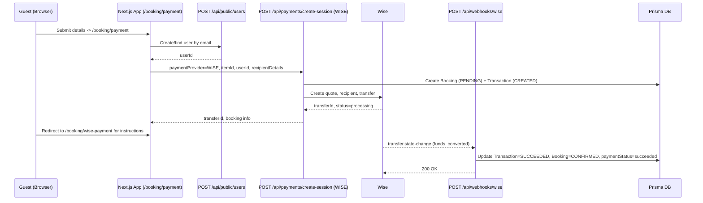

# DanceLink Platform | Site Architecture, Pages, Dashboards, CMS, and APIs

This document provides a detailed overview of the website’s public pages, dashboards, login flows, CMS capabilities, and API routes (including health checks) discovered from the codebase.

Repository: dance-platform-staging (Next.js 14 app router)

1) Public Pages (URLs and key features)

- Home (/)
  - Hero, featured classes/events, popular styles, stats blocks, newsletter/testimonials (configurable via CMS)
  - Data from: /api/public/stats, /api/public/featured, /api/public/content/homepage, /api/public/content/settings, /api/public/dance-styles, /api/public/events
- Classes
  - List: /classes
  - Detail: /classes/[id]
  - Booking: /classes/[id]/book
  - Booking success: /booking-success
- Events
  - List: /events
  - Detail: /events/[id]
- Instructors
  - List: /instructors
- Forum
  - List: /forum
  - New: /forum/new (requires auth)
  - Post detail: /forum/[postId]
- Partner Match
  - Landing: /partner-match (public landing)
- Academies (public)
  - List: /(public)/academies
  - Detail: /(public)/academies/[id]
- Become a Host: /become-a-host
- Static Content: /about, /contact, /faq, /pricing, /privacy, /terms
- Auth: /login, /register, /auth/login/[token] (tokenized login)
- Utility: /unauthorized

2) Dashboards and Features per Role

A) Student/User Dashboard (/dashboard)
- Entry: Standard login at /login
- Protected by middleware; redirects to /login if unauthenticated
- Layout: /dashboard/layout.tsx with sidebar navigation
- Pages:
  - /dashboard (overview: bookings, classes attended, spend, recommendations)
  - /dashboard/bookings (manage/view bookings)
  - /dashboard/payments (payment history)
  - /dashboard/profile (view/update profile)
  - /dashboard/notifications (user notification center/preferences)
  - /dashboard/settings (account/settings)
  - /dashboard/test-notifications (dev/test notifications)
  - /dashboard/partner-matching (partner profiles/requests; user + instructor only)

B) Host Dashboard (/host)
- Entry: Login at /login, or register as host at /register (host option)
- Protected by middleware for HOST or ADMIN
- Pages:
  - /host (overview)
  - /host/academies (list), /host/academies/new
  - /host/venues (list), /host/venues/new
  - /host/classes (list), /host/classes/new
  - /host/events (list), /host/events/new
  - /host/competitions (list), /host/competitions/new
  - /host/bookings (manage bookings)

C) Instructor Dashboard (/instructor)
- Entry: Login at /login (instructor role) or demo via login page buttons
- Protected by middleware for INSTRUCTOR or ADMIN
- Pages:
  - /instructor (overview)
  - /instructor/dashboard (analytics snapshot)
  - /instructor/classes (list), /instructor/classes/new, /instructor/classes/[id], /instructor/classes/[id]/edit
  - /instructor/students (list), /instructor/students/[userId]
  - /instructor/messages/new (message students)
  - /instructor/earnings (summary/transactions)
  - /instructor/analytics, /instructor/settings

D) Admin Dashboard (/admin)
- Entry (token login): /admin/login?token=YOUR_TOKEN
  - Server API: POST /api/auth/admin-token-login/[token]
- Protected by middleware for ADMIN only
- Main page: /admin
- Sections (represent high-level capabilities):
  - Users: manage users (/api/admin/users)
  - Instructors: manage instructors (/api/admin/instructors)
  - Hosts: manage hosts (/api/admin/hosts)
  - Classes: CRUD and scheduling (/api/admin/classes)
  - Events: CRUD (/api/admin/events)
  - Bookings: manage/edit bookings (/api/admin/bookings)
  - Venues: CRUD (/api/admin/venues)
  - Dance Styles: taxonomy management (/api/admin/dance-styles)
  - Transactions: analytics summary (uses stats endpoints)
  - Forum Moderation: moderate posts/replies (/api/admin/forum/*)
  - Notifications: compose/bulk/send, templates, analytics (/api/admin/notifications/*)
  - Partner Matching: profiles/requests/matches/stats (/api/admin/partner-matching/*)
  - Content Management (CMS): homepage/about/events/instructors/contact/settings (/api/admin/content/*)
  - SEO Management: per-path SEO entries (/api/admin/seo)
  - Audit Trail: logs, export CSV/JSON (/api/admin/audit-logs)
  - API Docs: /api-docs (UI) and /public/swagger.json (spec)
  - Login Tokens: /admin/login-tokens (UI) and /api/auth/login-tokens/*

3) Login Flows and Access Control

- Standard Login: /login (email/password)
  - Demo buttons for roles (user@demo.com, instructor@demo.com, host@demo.com)
  - On success, redirect by role: ADMIN -> /admin; HOST -> /host; INSTRUCTOR -> /instructor; USER -> /dashboard
- Registration: /register
  - Can select Student vs Host; Host collects business fields
- Token-based Login: /auth/login/[token]
  - Validates token via GET /api/auth/login-tokens/validate/[token]; tracks attempts via POST to same path
- Admin Token Login: /admin/login (?token=...)
  - POST /api/auth/admin-token-login/[token] then redirect to /admin
- Middleware (middleware.ts) protects routes:
  - Public: '/', '/login', '/register', '/admin/login', '/(public)/*', '/api/public/*', '/api/auth/*', assets
  - ADMIN-only: '/admin', '/api/admin/*'
  - INSTRUCTOR: '/instructor', '/api/instructor/*'
  - HOST: '/host', '/api/host/*'
  - Authenticated: '/dashboard', '/profile', etc.
  - Partner-matching: students (USER) and instructors

4) CMS Capabilities (Admin > Content Management)

- Editable areas, saved via /api/admin/content/* and served via /api/public/content/*:
  - Homepage: hero, about blurb, toggles for testimonials/newsletter, hero background upload
  - About: hero, stats, story, reasons/features, newsletter, CTA sections
  - Events page: hero, featured, search, CTA blocks
  - Instructors page: hero, stats labels, empty/error states, CTA with features
  - Contact page: hero, quick options, form fields/options, FAQ
  - Site Settings: site name/description, contact info, social links; footer config
- Actions in UI:
  - Load current content, edit, Save (PUT), Reset to defaults (DELETE/POST per page), Refresh cache (forces re-fetch of public endpoints)
- SEO Management:
  - CRUD per-path SEO entries: title/description/meta/canonical/OG/Twitter/schema; pagination and search
- Media Uploads:
  - POST /api/admin/upload/hero-bg (hero background image)

5) API Overview (Grouped) and Health URLs

Global Health and Docs
- Health: GET /api/health (200 OK = service healthy)
- Swagger JSON: GET /public/swagger.json
- API Docs UI: GET /api-docs (also /admin/api-docs)

Auth (/api/auth)
- POST /api/auth/login — Email/password login
- POST /api/auth/register — Registration
- POST /api/auth/logout — Logout
- GET /api/auth/me — Current user (requires auth)
- POST /api/auth/sessions — Create session; DELETE /api/auth/sessions (via body) or cleanup: /api/auth/sessions/cleanup
- POST /api/auth/switch-role — Developer utility to swap roles
- Demo: POST /api/auth/demo-login, POST /api/auth/instructor-demo-login
- Login tokens: 
  - POST /api/auth/login-tokens (create), GET /api/auth/login-tokens (list)
  - POST /api/auth/login-tokens/generate
  - GET /api/auth/login-tokens/validate/[token]
- Admin token login: POST /api/auth/admin-token-login/[token]
- Health check for auth: GET /api/auth/me (requires valid session) or GET /api/auth/debug in dev

Admin (/api/admin)
- Stats: GET /api/admin/stats (good health probe for admin domain; requires ADMIN)
- Users: GET/POST /api/admin/users, GET/PUT/DELETE /api/admin/users/[id]
- Instructors: GET/POST /api/admin/instructors, GET/PUT/DELETE /api/admin/instructors/[id]
- Hosts: GET/POST /api/admin/hosts, GET/PUT/DELETE /api/admin/hosts/[id]
- Classes: GET/POST /api/admin/classes, GET/PUT/DELETE /api/admin/classes/[id]
- Events: GET/POST /api/admin/events, GET/PUT/DELETE /api/admin/events/[id]
- Venues: GET/POST /api/admin/venues, GET/PUT/DELETE /api/admin/venues/[id]
- Bookings: GET/POST /api/admin/bookings, GET/PUT/DELETE /api/admin/bookings/[id]
- Dance Styles: GET/POST /api/admin/dance-styles, GET/PUT/DELETE /api/admin/dance-styles/[id]
- Forum Moderation: /api/admin/forum/posts, /api/admin/forum/replies
- Notifications:
  - GET /api/admin/notifications, POST /api/admin/notifications/send, POST /api/admin/notifications/bulk
  - Analytics: GET /api/admin/notifications/analytics, GET /api/admin/notifications/stats
  - Templates: GET/POST /api/admin/notifications/templates, GET/PUT/DELETE /api/admin/notifications/templates/[id]
- Partner Matching (admin):
  - Profiles: GET /api/admin/partner-matching/profiles, GET/PUT /api/admin/partner-matching/profiles/[id]
  - Requests: GET /api/admin/partner-matching/requests, PATCH /api/admin/partner-matching/requests/[id]
  - Matches: GET /api/admin/partner-matching/matches, GET/PUT /api/admin/partner-matching/matches/[id]
  - Stats: GET /api/admin/partner-matching/stats
- Content (CMS):
  - GET/PUT /api/admin/content/homepage | about | events | instructors | contact | settings
  - Reset endpoints via DELETE or POST as implemented per page module
- SEO: GET/POST /api/admin/seo, GET/PUT /api/admin/seo/[id]
- Audit Logs: GET /api/admin/audit-logs, GET /api/admin/audit-logs/stats, GET /api/admin/audit-logs/export
- Uploads: POST /api/admin/upload/hero-bg
- Suggested health for admin domain: GET /api/admin/stats (auth required)

Host (/api/host)
- Academies: GET/POST /api/host/academies
- Venues: GET/POST /api/host/venues
- Classes: GET/POST /api/host/classes
- Events: GET/POST /api/host/events
- Competitions: GET/POST /api/host/competitions
- Bookings: GET/POST /api/host/bookings
- Profile: GET/PUT /api/host/profile
- Stats: GET /api/host/stats
- Health for host domain: GET /api/host/stats (auth required)

Instructor (/api/instructor)
- Classes: GET/POST /api/instructor/classes
  - Single: GET/PUT/DELETE /api/instructor/classes/[id]
  - Sub-actions: POST /api/instructor/classes/[id]/publish, POST /api/instructor/classes/[id]/duplicate, POST /api/instructor/classes/[id]/attendance
- Students: GET /api/instructor/students, GET /api/instructor/students/[userid], GET /api/instructor/students/export
- Messages: POST /api/instructor/messages, POST /api/instructor/messages/class
- Earnings: GET /api/instructor/earnings/summary, GET /api/instructor/earnings/transactions, GET /api/instructor/earnings/export
- Resources: GET/POST /api/instructor/resources, POST /api/instructor/resources/upload, GET /api/instructor/resources/stats
- Dashboard: GET /api/instructor/dashboard/[id], plus engagement/performance profiles
- Profile: GET /api/instructor/profile/[userId]
- Health for instructor domain: GET /api/instructor/resources/stats (auth required)

Public (/api/public)
- Content: GET /api/public/content/homepage | about | events | settings
- Listings: GET /api/public/classes, GET /api/public/classes/[id]
- Events: GET /api/public/events, GET /api/public/events/[id]
- Instructors: GET /api/public/instructors
- Dance Styles: GET /api/public/dance-styles
- Bookings (public view): GET /api/public/bookings, GET /api/public/bookings/[id]
- Featured: GET /api/public/featured
- Stats: GET /api/public/stats
- Forum (public read): GET /api/public/forum/posts, GET /api/public/forum/posts/[postId]
- Health for public domain: GET /api/public/content/settings (lightweight)

Forum (authenticated authoring)
- Posts: GET/POST /api/forum/posts, GET/PUT/DELETE /api/forum/posts/[postId]
- Replies: GET/POST /api/forum/posts/[postId]/replies

Notifications (user)
- Preferences: GET/PUT /api/notifications/preferences
- Push subscribe: POST /api/notifications/push/subscribe
- Web push root: /api/notifications

Payments (/api/payments)
- POST /api/payments/create-session
- POST /api/payments/create-checkout-session
- POST /api/payments/create-payment-intent
- POST /api/payments/webhook (Stripe webhook)
- Health note: use global /api/health; payment endpoints are action-only

Other APIs
- Gallery: GET /api/gallery
- SEO aggregate: GET /api/seo
- Reviews: GET/POST /api/reviews, GET/PUT/DELETE /api/reviews/[id]
- Translate: POST /api/translate
- Helpers: GET /api/admin/helpers (admin-only helper data bundle)

6) Detailed Usage Flows (How to log in and access)

- Admin
  1) Obtain an admin token (via script or existing admin generating one)
  2) Go to /admin/login?token=YOUR_TOKEN
  3) On success you land on /admin
  4) Use left navigation to access Users, Classes, Events, Bookings, Venues, Styles, Notifications, Partner Matching, Content, SEO, Audit, etc.

- Host
  1) Register at /register and choose Host Account (or be assigned HOST role)
  2) Login at /login
  3) You’ll be redirected to /host; create academy/venues, then classes/events/competitions; review bookings

- Instructor
  1) Login at /login (or use demo Instructor)
  2) You’ll be redirected to /instructor; create/manage classes, see students, send messages, review earnings/analytics

- Student/User
  1) Login at /login (or use demo Student)
  2) Land on /dashboard; browse classes/events from public pages and manage bookings/payments/notifications in dashboard

7) Security and Access Summary

- Route protection enforced in middleware.ts via cookies/JWT inspection
- Roles: ADMIN, HOST, INSTRUCTOR, USER; some user features (partner-matching) available to USER and INSTRUCTOR
- Unauthorized users are redirected to /login or /unauthorized accordingly

8) Observability and Health Checks

- Global: GET /api/health
- Domain-specific checks (authenticated):
  - Admin: GET /api/admin/stats
  - Host: GET /api/host/stats
  - Instructor: GET /api/instructor/resources/stats
  - Public: GET /api/public/content/settings
- API Docs/Spec: /api-docs and /public/swagger.json

Notes
- Many admin actions use RESTful patterns; UI pages map closely to /api/admin/* endpoints
- CMS is in-admin (no external headless CMS); content is persisted and served via /api/public/content/*
- Payments integrate Stripe via the listed endpoints; configure credentials in environment

9) Booking System and Payment Processing

Booking models and statuses
- Booking (prisma model):
  - Fields: id, userId, classId/eventId, bookingDate, status, totalAmount, amountPaid, discountAmount, taxAmount, paymentStatus, confirmationCode, stripeSessionId
  - Status (BookingStatus): PENDING, CONFIRMED, CANCELLED, COMPLETED, REFUNDED
  - Payment status (string): pending, processing, succeeded, failed, canceled
- Transaction (prisma model):
  - Fields: id, bookingId, userId, provider (STRIPE or WISE), providerPaymentId, type (PAYMENT/REFUND), status (CREATED, SUCCEEDED, FAILED, REFUNDED, CANCELLED), amount, currency, payload, stripeSessionId, brand/last4/paymentMethodType

Key booking endpoints
- Public guest booking (no account): POST /api/public/bookings
  - Creates a user if needed; creates PENDING booking; sends email instructions
- User bookings: GET /api/user/bookings/[userId]
- Manage a booking: /api/bookings/manage/[bookingId]
  - DELETE: cancel with optional refund request (policy-based)
  - PATCH: reschedule to a new class (with price-difference handling)
- Advanced booking tools: POST /api/bookings/advanced (type=package|waitlist|recurring)
  - Type=package: creates a class package + initial booking
  - Type=waitlist: adds user to waitlist if class full
  - Type=recurring: creates series classes and related bookings

Payment providers and endpoints
- Unified session creation (Stripe or Wise): POST /api/payments/create-session
  - Body: paymentProvider (STRIPE|WISE), bookingType (class|event), itemId, userId, optional customAmount/discountAmount/taxAmount
  - Stripe requires successUrl and cancelUrl; Wise requires wiseRecipientDetails
- Stripe-only flows:
  - Checkout Session: POST /api/payments/create-checkout-session (creates Booking + Stripe session and Transaction)
  - Payment Intent: POST /api/payments/create-payment-intent (for client-side card elements flow)
  - Webhook: POST /api/payments/webhook (handles checkout.session.completed, payment_intent.succeeded/failed/canceled, disputes)
- Wise flows:
  - Session creation via /api/payments/create-session with paymentProvider=WISE
  - Webhook: POST /api/webhooks/wise (maps Wise statuses to internal booking/transaction statuses)

User-facing booking/payment pages
- Booking success page: /booking-success (public success screen for guest flow)
- Payment selection page: /booking/payment (guest flow; lets user pick Stripe vs Wise)
- Booking confirmation after Stripe checkout: /booking/confirmation/[sessionId]

Booking flows
- Authenticated Stripe checkout (signed-in user)
  1) User clicks Book on class/event
  2) Client calls POST /api/payments/create-checkout-session with bookingType, itemId, userId, and success/cancel URLs
  3) Server creates Booking (PENDING, paymentStatus=pending) and Stripe Checkout Session, then Transaction (status=CREATED)
  4) User is redirected to Stripe; on success, Stripe calls webhook POST /api/payments/webhook
  5) Webhook updates Booking to CONFIRMED, paymentStatus=succeeded; amountPaid set; increments class/event counts; Transaction set to SUCCEEDED; confirmation email sent
  6) Browser is redirected to /booking/confirmation/{CHECKOUT_SESSION_ID}

- Guest booking + payment selection
  1) On class/event page, the guest uses GuestBookingForm/EnhancedGuestBookingForm to input details
  2) Client redirects to /booking/payment?data={encoded booking data}
  3) On /booking/payment, app creates or finds a user (POST /api/public/users), then calls POST /api/payments/create-session with selected paymentProvider
  4a) If STRIPE: response contains sessionUrl -> redirect to Stripe; webhook confirms booking as above; confirmation page at /booking/confirmation/{CHECKOUT_SESSION_ID}
  4b) If WISE: response returns transferId/quoteId -> client navigates to wise-specific instructions page (/booking/wise-payment); Wise webhook updates booking when funds convert/sent

- Cancellation and rescheduling (policies enforced server-side)
  - Cancel: DELETE /api/bookings/manage/[bookingId]
    - Policy: refund tiers by hours until start (>=24h: 100%, >=12h: 75%, >=2h: 50%, <2h: not allowed)
    - Effects: Booking -> CANCELLED; paymentStatus -> refund_pending if applicable; decrements class/event counts; processes waitlist; creates Refund record
  - Reschedule: PATCH /api/bookings/manage/[bookingId] with newClassId
    - Checks availability and policy (free >=12h, $5 between 4-12h, disallowed <4h)
    - Updates capacities, may create Refund or require extra payment for price difference; sends email

Payment processing details
- Stripe
  - Session metadata includes bookingId, userId, bookingType
  - Webhook events:
    - checkout.session.completed: confirms booking + increments attendance + sends email
    - payment_intent.succeeded/failed/canceled: updates Transaction/Booking accordingly
    - charge.dispute.created: records audit and logs
- Wise
  - Unified API in app/lib/wise.ts (quote, recipient, transfer, status)
  - Webhook status mapping (examples):
    - funds_converted/outgoing_payment_sent -> Transaction SUCCEEDED, Booking CONFIRMED, paymentStatus=succeeded
    - bounced_back/charged_back -> Transaction FAILED, Booking CANCELLED, paymentStatus=failed
    - cancelled -> Transaction CANCELLED, Booking CANCELLED

Admin/ops usage
- Reconcile payments via Transactions in the admin (TransactionAnalytics, PaymentManagement)
- Audit logs record payment disputes and state changes
- Refunds: created by cancellation or admin flows (see Refund model/endpoints if present)

API health for bookings/payments
- Global: GET /api/health (includes paymentProviders config state)
- Stripe webhook health: POST /api/payments/webhook (responds 200 on valid events; 405 for GET)
- Wise webhook health: POST /api/webhooks/wise (expects valid signature)
- Booking health checks:
  - Read: GET /api/public/bookings/[id]
  - User list: GET /api/user/bookings/[userId]

Example requests
- Create Stripe checkout session (server-to-server):
  curl -X POST /api/payments/create-checkout-session \
    -H 'Content-Type: application/json' \
    -d '{
      "bookingType":"class",
      "itemId":"<CLASS_ID>",
      "userId":"<USER_ID>",
      "successUrl":"https://yourdomain.com/booking/confirmation/{CHECKOUT_SESSION_ID}",
      "cancelUrl":"https://yourdomain.com/classes"
    }'

- Create unified session (Wise):
  curl -X POST /api/payments/create-session \
    -H 'Content-Type: application/json' \
    -d '{
      "paymentProvider":"WISE",
      "bookingType":"event",
      "itemId":"<EVENT_ID>",
      "userId":"<USER_ID>",
      "wiseRecipientDetails": {"name":"Recipient Name","email":"recipient@example.com","currency":"USD","type":"EMAIL"},
      "successUrl":"https://yourdomain.com/booking/confirmation/{CHECKOUT_SESSION_ID}",
      "cancelUrl":"https://yourdomain.com/events"
    }'

10) Sequence diagrams

Authenticated Stripe checkout

PNG: docs/diagrams/authenticated-stripe-checkout.png (render via script below)
```mermaid
sequenceDiagram
  participant U as User (Browser)
  participant FE as Next.js App
  participant API as POST /api/payments/create-checkout-session
  participant S as Stripe
  participant WH as POST /api/payments/webhook
  participant DB as Prisma DB
  U->>FE: Click Book on class/event
  FE->>API: bookingType, itemId, userId, successUrl, cancelUrl
  API->>DB: Create Booking (PENDING), Transaction (CREATED)
  API->>S: Create Checkout Session
  S-->>API: session.id, session.url
  API-->>FE: Return sessionUrl
  FE->>S: Redirect to Stripe Checkout
  S-->>WH: checkout.session.completed
  WH->>DB: Update Booking=CONFIRMED, paymentStatus=succeeded; Transaction=SUCCEEDED; increment counts
  WH-->>S: 200 OK
  U->>FE: Redirect to /booking/confirmation/{CHECKOUT_SESSION_ID}
```

Guest booking + Wise transfer

PNG: docs/diagrams/guest-wise-payment.png (render via script below)


11) Endpoint to source file map

Auth
- POST /api/auth/login → app/api/auth/login/route.ts
- POST /api/auth/register → app/api/auth/register/route.ts
- POST /api/auth/logout → app/api/auth/logout/route.ts
- GET /api/auth/me → app/api/auth/me/route.ts
- POST /api/auth/admin-token-login/[token] → app/api/auth/admin-token-login/[token]/route.ts
- POST /api/auth/login-tokens → app/api/auth/login-tokens/route.ts
- POST /api/auth/login-tokens/generate → app/api/auth/login-tokens/generate/route.ts
- GET /api/auth/login-tokens/validate/[token] → app/api/auth/login-tokens/validate/[token]/route.ts

Admin
- GET /api/admin/stats → app/api/admin/stats/route.ts
- GET/POST /api/admin/users → app/api/admin/users/route.ts; item → app/api/admin/users/[id]/route.ts
- GET/POST /api/admin/instructors → app/api/admin/instructors/route.ts; item → app/api/admin/instructors/[id]/route.ts
- GET/POST /api/admin/hosts → app/api/admin/hosts/route.ts; item → app/api/admin/hosts/[id]/route.ts
- GET/POST /api/admin/classes → app/api/admin/classes/route.ts; item → app/api/admin/classes/[id]/route.ts
- GET/POST /api/admin/events → app/api/admin/events/route.ts; item → app/api/admin/events/[id]/route.ts
- GET/POST /api/admin/bookings → app/api/admin/bookings/route.ts
- GET/POST /api/admin/venues → app/api/admin/venues/route.ts
- GET/POST /api/admin/dance-styles → app/api/admin/dance-styles/route.ts; item → app/api/admin/dance-styles/[id]/route.ts
- Forum moderation → app/api/admin/forum/posts/route.ts; app/api/admin/forum/replies/route.ts
- Notifications → app/api/admin/notifications/route.ts; send → app/api/admin/notifications/send/route.ts; analytics → app/api/admin/notifications/analytics/route.ts; stats → app/api/admin/notifications/stats/route.ts; templates → app/api/admin/notifications/templates/route.ts and app/api/admin/notifications/templates/[id]/route.ts
- Partner matching → profiles: app/api/admin/partner-matching/profiles/route.ts & [id]/route.ts; requests: app/api/admin/partner-matching/requests/route.ts & [id]/route.ts; matches: app/api/admin/partner-matching/matches/route.ts & [id]/route.ts; stats: app/api/admin/partner-matching/stats/route.ts
- CMS content → app/api/admin/content/homepage/route.ts, .../about/route.ts, .../events/route.ts, .../instructors/route.ts, .../contact/route.ts, .../settings/route.ts
- SEO → app/api/admin/seo/route.ts; item → app/api/admin/seo/[id]/route.ts
- Audit logs → list: app/api/admin/audit-logs/route.ts; stats: app/api/admin/audit-logs/stats/route.ts; export: app/api/admin/audit-logs/export/route.ts
- Helpers → app/api/admin/helpers/route.ts
- Uploads → app/api/admin/upload/hero-bg/route.ts
- Tables → app/api/admin/tables/route.ts

Host
- /api/host/academies → app/api/host/academies/route.ts
- /api/host/venues → app/api/host/venues/route.ts
- /api/host/classes → app/api/host/classes/route.ts
- /api/host/events → app/api/host/events/route.ts
- /api/host/competitions → app/api/host/competitions/route.ts
- /api/host/bookings → app/api/host/bookings/route.ts
- /api/host/profile → app/api/host/profile/route.ts
- /api/host/stats → app/api/host/stats/route.ts

Instructor
- /api/instructor/classes → app/api/instructor/classes/route.ts; item → app/api/instructor/classes/[id]/route.ts; actions: publish → app/api/instructor/classes/[id]/publish/route.ts; duplicate → app/api/instructor/classes/[id]/duplicate/route.ts; attendance → app/api/instructor/classes/[id]/attendance/route.ts
- /api/instructor/students → app/api/instructor/students/route.ts; item → app/api/instructor/students/[userid]/route.ts; export → app/api/instructor/students/export/route.ts; stats → app/api/instructor/students/stats/route.ts
- /api/instructor/messages → app/api/instructor/messages/route.ts; class → app/api/instructor/messages/class/route.ts
- Earnings → summary: app/api/instructor/earnings/summary/route.ts; transactions: app/api/instructor/earnings/transactions/route.ts; export: app/api/instructor/earnings/export/route.ts
- Resources → list/create: app/api/instructor/resources/route.ts; item: app/api/instructor/resources/[id]/route.ts; upload: app/api/instructor/resources/upload/route.ts; stats: app/api/instructor/resources/stats/route.ts
- Dash/analytics → dashboard: app/api/instructor/dashboard/[id]/route.ts; engagement: app/api/instructor/engagement/[instructorId]/route.ts; performance: app/api/instructor/performance/[instructorId]/route.ts; profile: app/api/instructor/profile/[userId]/route.ts

Public
- Content → app/api/public/content/homepage/route.ts, .../about/route.ts, .../events/route.ts, .../settings/route.ts
- Classes → app/api/public/classes/route.ts; item → app/api/public/classes/[id]/route.ts
- Events → app/api/public/events/route.ts; item → app/api/public/events/[id]/route.ts
- Instructors → app/api/public/instructors/route.ts
- Dance styles → app/api/public/dance-styles/route.ts
- Bookings (read) → app/api/public/bookings/route.ts; item → app/api/public/bookings/[id]/route.ts
- Forum (read) → app/api/public/forum/posts/route.ts; item → app/api/public/forum/posts/[postId]/route.ts
- Academies → app/api/public/academies/route.ts; item → app/api/public/academies/[id]/route.ts

Bookings domain
- Manage booking → DELETE/PATCH /api/bookings/manage/[bookingId] → app/api/bookings/manage/[bookingId]/route.ts
- Advanced → POST /api/bookings/advanced → app/api/bookings/advanced/route.ts

Payments domain
- Unified create session → POST /api/payments/create-session → app/api/payments/create-session/route.ts
- Stripe create checkout session → POST /api/payments/create-checkout-session → app/api/payments/create-checkout-session/route.ts
- Stripe create payment intent → POST /api/payments/create-payment-intent → app/api/payments/create-payment-intent/route.ts
- Stripe webhook → POST /api/payments/webhook → app/api/payments/webhook/route.ts
- Wise webhook → POST /api/webhooks/wise → app/api/webhooks/wise/route.ts

Misc
- Health → GET /api/health → app/api/health/route.ts
- Swagger JSON → GET /api/swagger → app/api/swagger/route.ts; public spec → public/swagger.json
